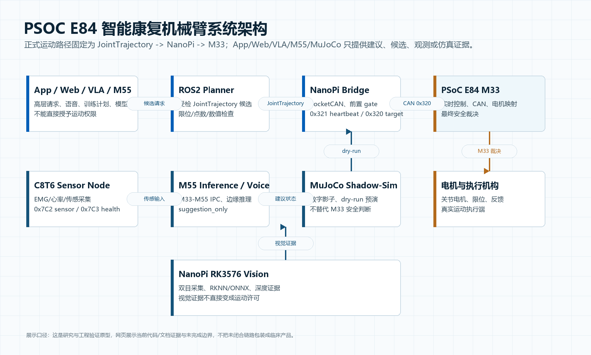
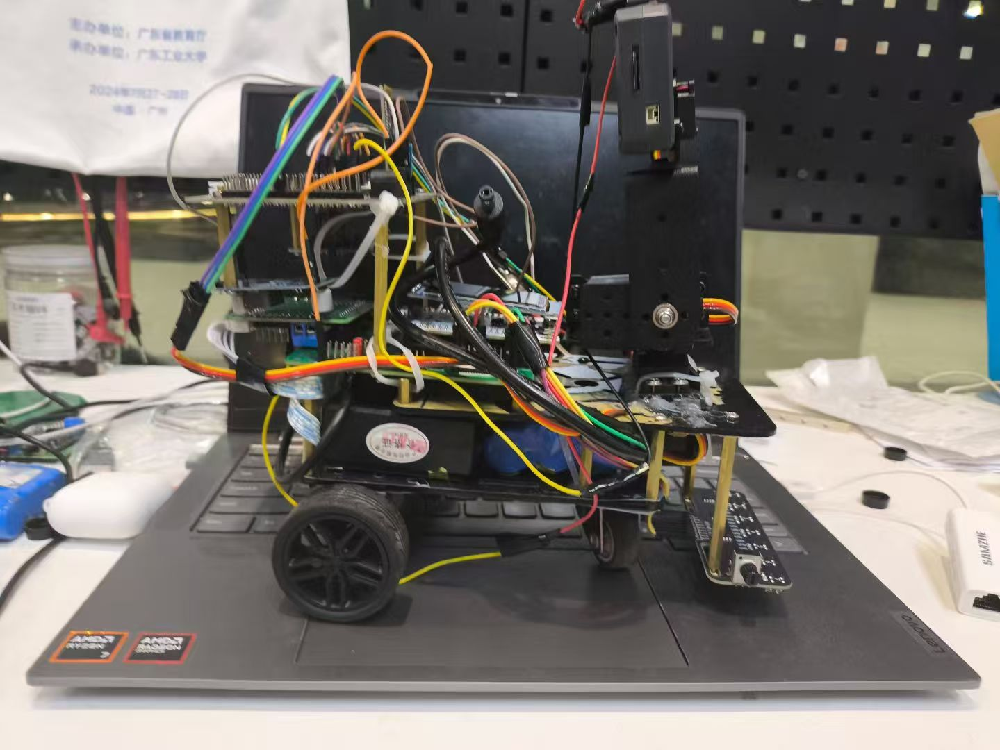
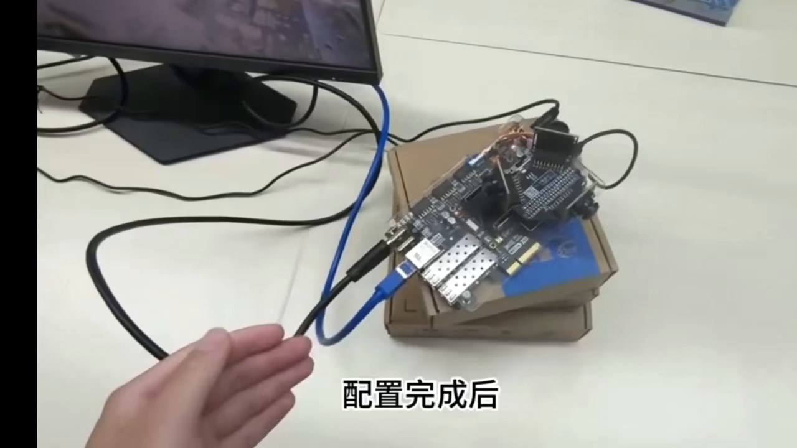
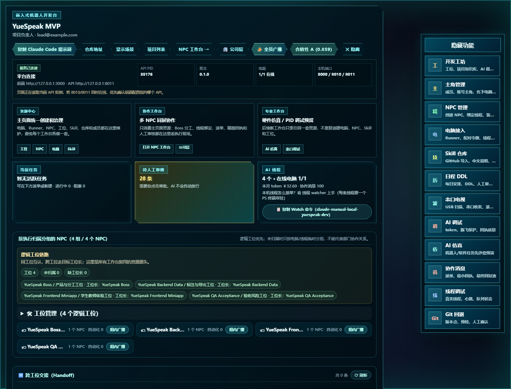
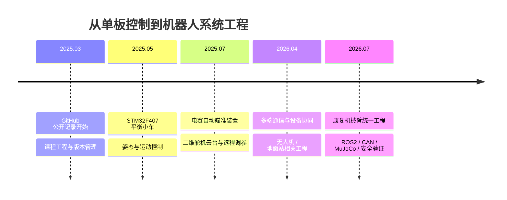

<p align="center">
  
</p>

<div align="center">
  <a href="https://git.io/typing-svg">
    
  </a>
  <br />
  <a href="https://github.com/wenjunyong666"></a>
  <a href="http://106.55.62.122/site/"></a>
  <a href="mailto:3245056131@qq.com"></a>
  <br />
  
  
  
</div>

## `> 个人定位`

```yaml
name: 温俊勇
education: 广东工业大学 · 电子信息 · 本科
career_goal: 机器人嵌入式工程师
focus: [机器人底层控制, 嵌入式软件, Linux 设备端, 机器人通信与系统联调]
working_on: [康复机械臂, 多 Agent 协作平台, 真实设备智能化]
engineering_style: 从需求拆解到设备联调，从控制闭环到可视化交付
```

我的长期就业方向是 **机器人嵌入式**。我关注的不只是单个驱动或算法，而是把 **传感器输入、通信协议、任务调度、控制算法、执行机构和上位机** 连成可运行、可验证、可复盘的完整机器人系统。

## 实习经历

### 广州途道信息科技有限公司 · 嵌入式软件实习生

`2026.02 — 2026.06` · 智能硬件 / 机器人设备端

- 参与智能硬件设备端开发，围绕 **ESP32-S3、ESP-IDF、FreeRTOS、BLE、LVGL** 完成设备功能实现与联调。
- 重点负责蓝牙协议链路：处理数据帧解析、校验、长包分片重组，以及设备状态/图片显示类指令的接收与响应。
- 参与显示页面、设备交互和外围执行功能的嵌入式实现，定位协议不一致、资源缺失、串口烧录和显示生命周期等问题。
- 与上层应用、硬件和测试协作，把“协议定义”落实成可观察、可复现、可验证的设备行为。

> 公司项目不在这里挂仓库链接；主页只展示可公开的个人项目和通用工程能力。

### 图灵智新 · 机器人开发暑期实习生

`2026.07 — 2026.08` · 机器人开发 / 暑期实习

目前先记录岗位与实习时间，具体参与模块、使用技术、个人负责内容和项目成果待后续补充。

## 六个代表项目

<table>
  <tr>
    <td width="50%" valign="top">
      <p align="center"></p>
      <h3 align="center"><a href="https://github.com/HalloYang06/PSOC_E84_robot">医疗康复机械臂及外骨骼</a></h3>
      <p>ROS2 · CAN · PSoC · NanoPi · MuJoCo · VLA</p>
      <p>围绕康复机械臂建立分层架构，梳理真实运动安全链路、仿真验证、状态桥接和上层指令门控。</p>
    </td>
    <td width="50%" valign="top">
      <p align="center"></p>
      <h3 align="center"><a href="https://github.com/wenjunyong666/wuliuxiaoche">工创物流小车</a></h3>
      <p>STM32F750 · FreeRTOS · Jetson Nano · OpenCV</p>
      <p>负责整车控制、麦克纳姆轮解算、IMU 姿态修正、视觉闭环对位以及升降与舵机机构联调。</p>
    </td>
  </tr>
  <tr>
    <td width="50%" valign="top">
      <p align="center"></p>
      <h3 align="center"><a href="https://github.com/wenjunyong666/ai-">AI 合作平台</a></h3>
      <p>多智能体 · 任务编排 · 执行器 · 网页与服务器部署</p>
      <p>独立设计“项目 -> 工位 -> NPC -> 线程 -> Runner”协作模型、可视化工作台和安全执行边界。</p>
    </td>
    <td width="50%" valign="top">
      <p align="center"></p>
      <h3 align="center"><a href="https://github.com/wenjunyong666/25diansai">2025 电赛自动瞄准装置</a></h3>
      <p>STM32F407 · MaixCam · PID · IMU · 编码器</p>
      <p>运动控制负责人；实现视觉坐标到双轴云台的闭环控制和小车多环控制，获广东省二等奖。</p>
    </td>
  </tr>
  <tr>
    <td width="50%" valign="top">
      <p align="center"></p>
      <h3 align="center"><a href="https://github.com/wenjunyong666/humidifier_freertos">物联网智能加湿器</a></h3>
      <p>ESP32-S3 · FreeRTOS · MQTTS · OneNet · OLED</p>
      <p>双核任务组织、设备物模型、远程控制、本地交互和目标湿度回差控制。</p>
    </td>
    <td width="50%" valign="top">
      <p align="center"></p>
      <h3 align="center"><a href="https://github.com/wenjunyong666/quanjinhuiyishexiangtou">全景会议摄像头</a></h3>
      <p>FPGA · OV5640 · UDP-RGMII · OpenCV · SIFT</p>
      <p>负责多摄像头畸变校准、视角对齐和拼接融合，并参与 FPGA 图传与上位机组帧联调。</p>
    </td>
  </tr>
</table>

## 机器人嵌入式能力图谱

<div align="center">
  <h3>编程与系统</h3>
  
  <h3>芯片、实时系统与机器人</h3>
  
  
  
  
  
  
  
  <h3>视觉与仿真</h3>
  
  
  
</div>

| 能力层 | 我能处理的内容 | 对应项目 |
|---|---|---|
| 感知与输入 | 相机、IMU、编码器、温湿度、水位、EMG 等传感器接入 | 物流小车 / 电赛装置 / 加湿器 / 康复机械臂 |
| 协议与通信 | BLE、CAN、UART/DMA、TCP、UDP、MQTT、USB CDC | 途道实习 / 康复机械臂 / 无人机相关工程经验 |
| 控制与执行 | PID、多环控制、状态机、轨迹约束、步进电机、舵机、底盘 | 物流小车 / 电赛装置 / 康复机械臂 |
| 系统与验证 | FreeRTOS 任务、ROS2 桥接、日志、仿真、远程调参、故障复现 | 六个代表项目与实习经历 |

## 从传感器到机器人动作

```text
相机 / IMU / 编码器 / BLE
            ↓
驱动层与协议层：采集、校验、缓存、分片重组
            ↓
任务层：FreeRTOS / ROS2 / 状态机 / 日志
            ↓
控制层：PID / 轨迹约束 / 安全限幅 / 参数整定
            ↓
执行层：电机 / 舵机 / 云台 / 机械臂 / 底盘
            ↖──────── 网页监控、仿真验证、远程调参
```

## 项目实物与系统图

<table>
  <tr>
    <td width="50%" valign="top"><a href="https://github.com/HalloYang06/PSOC_E84_robot"></a><br /><strong>康复机械臂：安全运动链路</strong></td>
    <td width="50%" valign="top"><a href="https://github.com/wenjunyong666/25diansai"></a><br /><strong>电赛装置：视觉闭环与运动控制</strong></td>
  </tr>
  <tr>
    <td width="50%" valign="top"><a href="https://github.com/wenjunyong666/quanjinhuiyishexiangtou"></a><br /><strong>全景摄像头：FPGA 图传与拼接</strong></td>
    <td width="50%" valign="top"><a href="https://github.com/wenjunyong666/ai-"></a><br /><strong>AI 合作平台：项目与任务工作台</strong></td>
  </tr>
</table>

## 开源贡献与代码统计

<div align="center">
  
  
</div>

<div align="center">
  
</div>

<div align="center">
  
  
</div>

<div align="center">
  
</div>

> 统计卡片根据公开仓库动态生成；私有仓库贡献是否展示取决于 GitHub 个人资料的隐私设置。

### 公开贡献快照 · 2026-07-24

<div align="center">
  
  
  
  
</div>

这组数字取自公开 GitHub 主页和公开统计卡片，是一个时间快照，不把不可见的私有仓库名称或未公开贡献强行归因到某个项目。更重要的是，可以从下面的时间线看到代码活动对应的工程主题变化。

### 工程贡献时间线

| 时间 | 公开记录 | 工程主题 | 代表性输出 |
|---|---|---|---|
| `2025.03` | 建立最早一批公开仓库 | 从课程与练习开始使用版本管理 | `task`、`my-first-task` |
| `2025.05` | `pinghengxiaoche` 更新 | 进入 STM32F407 姿态与运动控制 | 平衡小车闭环控制 |
| `2025.07` | 电赛项目阶段 | 二维舵机云台、小车运动和现场参数收敛 | VOFA+ + 蓝牙远程调参 |
| `2026.02` | `daotuproject` 更新 | 补全底层知识与工程表达 | 汇编 / 课程工程整理 |
| `2026.04` | `TriLink-Drone-Control-System`、`keshe` 更新 | 从单板控制扩展到多端通信和系统协同 | 遥控器、地面站、设备端 |
| `2026.06` | 个人项目集中整理 | 视觉、物联网、AI 协作与机器人项目并行推进 | 作品集工程链路 |
| `2026.07` | `PSOC_E84_robot` 与相关工程持续推进 | 从功能实现走向安全边界、验证证据和现场降级 | ROS2/CAN、MuJoCo、RK3576、双核 SMIF/XIP |



## 竞赛与荣誉

<div align="center">
  
  
  
</div>

## 贡献轨迹

<p align="center">
  <picture>
    <source media="(prefers-color-scheme: dark)" srcset="https://raw.githubusercontent.com/wenjunyong666/wenjunyong666/output/github-snake-dark.svg" />
    <source media="(prefers-color-scheme: light)" srcset="https://raw.githubusercontent.com/wenjunyong666/wenjunyong666/output/github-snake.svg" />
    
  </picture>
</p>

<details>
  <summary><strong>我更擅长解决什么问题</strong></summary>
  <br />
  <ul>
    <li>把视觉或传感器结果稳定映射为电机、舵机和底盘动作。</li>
    <li>通过 CAN、UART、TCP、UDP、MQTT 打通 MCU、Linux 设备端与云端。</li>
    <li>用状态机、FreeRTOS 和 ROS2 拆分复杂任务，并保留安全边界与调试入口。</li>
    <li>使用仿真、日志、测试和文档让系统行为可验证、问题可复现。</li>
    <li>将 AI 编程工具纳入真实工程流程，而不是只停留在代码生成。</li>
  </ul>
</details>

<p align="center">
  <a href="http://106.55.62.122/site/"></a>
  <a href="mailto:3245056131@qq.com"></a>
</p>

<p align="center">
  
</p>
