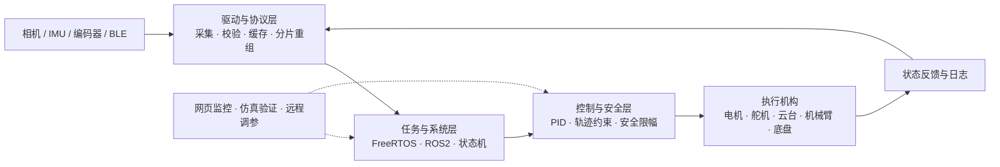
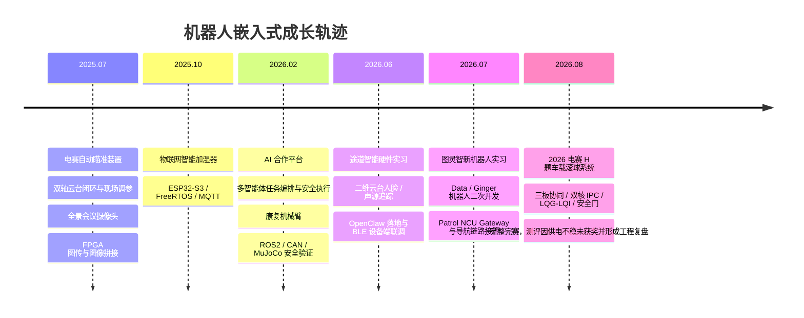

<p align="center">
  
</p>

<div align="center">
  <a href="https://git.io/typing-svg">
    
  </a>
  <br />
  <a href="https://github.com/wenjunyong666"></a>
  <a href="https://106.55.62.122/site/"></a>
  <a href="mailto:3245056131@qq.com"></a>
  <br />
  
  
  
</div>

## `> 个人定位`

```yaml
name: 温俊勇
education: 广东工业大学 · 电子信息 · 本科
career_goal: 机器人嵌入式工程师
focus: [机器人底层控制, 嵌入式软件, Linux 设备端, 机器人通信与系统联调]
working_on: [康复机械臂, 多 Agent 协作平台, 真实设备智能化]
engineering_style: 从需求拆解到设备联调，从控制闭环到可视化交付
```

我的长期就业方向是 **机器人嵌入式**。我关注的不只是单个驱动或算法，而是把 **传感器输入、通信协议、任务调度、控制算法、执行机构和上位机** 连成可运行、可验证、可复盘的完整机器人系统。

## 项目直达｜打开即看

<div align="center">
  <p><strong>先选工程方向，再进入详情页；每页都包含职责、系统链路、验证证据与代码入口。</strong></p>
  <a href="https://106.55.62.122/site/projects/medical-rehab-arm/"></a>
  <a href="https://106.55.62.122/site/projects/gongchuang-logistics-car/"></a>
  <br />
  <a href="https://106.55.62.122/site/projects/ti-2026-h-ball-control/"></a>
  <a href="https://106.55.62.122/site/projects/diansai-auto-aiming/"></a>
  <br />
  <a href="https://106.55.62.122/site/projects/panoramic-conference-camera/"></a>
  <a href="https://106.55.62.122/site/projects/iot-humidifier-console/"></a>
  <br />
  <a href="https://106.55.62.122/site/projects/ai-collab-platform/"></a>
</div>

| 想了解什么 | 最快入口 |
|---|---|
| 30 秒判断岗位匹配 | [打开完整作品集首页](https://106.55.62.122/site/) |
| 深挖源码与工程记录 | [查看全部公开仓库](https://github.com/wenjunyong666?tab=repositories) |
| 查看实习与获奖证据 | [打开 Evidence 目录](https://github.com/wenjunyong666/wenjunyong666/tree/main/evidence) |
| 直接联系 | [3245056131@qq.com](mailto:3245056131@qq.com) |

## 实习经历

### 广州途道信息科技有限公司 · 嵌入式软件实习生

`2026.02 — 2026.06` · 智能硬件 / 机器人设备端

<p>
  
  
  
  
  
  
  
</p>

- **桌面宠物：** 负责二维电机云台运动控制，接入摄像头人脸坐标与三方向麦克风声源方向，完成输入到水平 / 俯仰目标的映射；设计“人脸优先、无人脸再追踪声源”的仲裁和失目标切换逻辑。
- **Agent 落地：** 将 OpenClaw 部署到宠物机器人，打通 ESP32-S3 HTTP 服务、千问调用与舵机 / LCD 工具；另在 K230 上完成 OpenClaw 与摄像头识别结果的接入，使 AI 能基于视觉信息参与交互。
- **AI Pet 联调：** 实现 BLE GATT 自定义帧、CRC 与跨 Write 长帧重组，并将二维码、静态图、GIF 等命令接入 LVGL，处理资源映射、页面切换和对象生命周期问题。

### 图灵智新 · 机器人二次开发暑期实习生

`2026.07 — 2026.08` · 机器人开发 / 暑期实习

<p>
  
  
  
  
  
  
</p>

- **Data / Ginger 机器人：** 负责计算平台、原生接口、执行与感知设备的整机接入，打通感知输入、状态回读和动作执行链路，使机器人本体与视觉、语音、VLA 服务协同工作。
- **Patrol3 无人车：** 负责车载 NCU、ROS1 与 Gateway 导航链路联调，整合地图定位、目标下发、路径跟踪、实时位姿和软件急停，形成地图交互到路径、位姿与安全状态回传的软件闭环，并沉淀部署与验证流程。

## 七个代表项目

<table>
  <tr>
    <td width="50%" valign="top">
      <p align="center"></p>
      <h3 align="center"><a href="https://github.com/HalloYang06/PSOC_E84_robot">医疗康复机械臂及外骨骼</a></h3>
      <p align="center"> </p>
      <p>ROS2 · CAN · PSoC · NanoPi · MuJoCo · VLA</p>
      <p>打通传感节点、PSoC 双核、CAN 多电机、ROS2 / App / Web 与 MuJoCo，形成从感知输入到安全执行的系统原型，并支持 EMG、视觉和 VLA 扩展。</p>
    </td>
    <td width="50%" valign="top">
      <p align="center"></p>
      <h3 align="center"><a href="https://github.com/wenjunyong666/wuliuxiaoche">工创物流小车</a></h3>
      <p align="center"> </p>
      <p>STM32F750 · FreeRTOS · NanoPi RK3576 · RKNN</p>
      <p>将 STM32、NanoPi 双摄视觉、底盘与多执行机构串成统一任务链，完成任务识别、车辆对位、物料取放、加工到返航的整车自动作业闭环。</p>
    </td>
  </tr>
  <tr>
    <td width="50%" valign="top">
      <p align="center"></p>
      <h3 align="center"><a href="https://github.com/wenjunyong666/ai-">AI 合作平台</a></h3>
      <p align="center"> </p>
      <p>多智能体 · 任务编排 · 执行器 · 网页与服务器部署</p>
      <p>独立设计“项目 -> 工位 -> NPC -> 线程 -> Runner”协作模型、可视化工作台和安全执行边界。</p>
    </td>
    <td width="50%" valign="top">
      <p align="center"></p>
      <h3 align="center"><a href="https://github.com/wenjunyong666/25diansai">2025 电赛自动瞄准装置</a></h3>
      <p align="center"> </p>
      <p>STM32F407 · MaixCam · PID · IMU · 编码器</p>
      <p>运动控制负责人；实现视觉坐标到双轴云台的闭环控制和小车多环控制，获广东省二等奖。</p>
    </td>
  </tr>
  <tr>
    <td width="50%" valign="top">
      <p align="center"></p>
      <h3 align="center"><a href="https://github.com/wenjunyong666/humidifier_freertos">物联网智能加湿器</a></h3>
      <p align="center"> </p>
      <p>ESP32-S3 · FreeRTOS · MQTTS · OneNet · OLED</p>
      <p>双核任务组织、设备物模型、远程控制、本地交互和目标湿度回差控制。</p>
    </td>
    <td width="50%" valign="top">
      <p align="center"></p>
      <h3 align="center"><a href="https://github.com/wenjunyong666/quanjinhuiyishexiangtou">全景会议摄像头</a></h3>
      <p align="center"> </p>
      <p>FPGA · OV5640 · UDP-RGMII · OpenCV · SIFT</p>
      <p>负责多摄像头畸变校准、视角对齐和拼接融合，并参与 FPGA 图传与上位机组帧联调。</p>
    </td>
  </tr>
  <tr>
    <td width="100%" valign="top" colspan="2">
      <p align="center"></p>
      <h3 align="center"><a href="https://github.com/HalloYang06/2026_TI">2026 电赛 H 题车载滚球平衡系统</a></h3>
      <p align="center"> </p>
      <p align="center">MSPM0G3507 · Infineon EdgeTalk M33/M55 · Raspberry Pi · RS00 · CAN · LQG/LQI</p>
      <p>参与完成三板车载滚球系统，重点推进压力仿真、双核 IPC、RS00 安全门、任务 CAN、Q1–Q6 状态机、MSPM0 确定性调度与 IMU 队列/栈问题修复。项目完整完赛，但正式测评现场因电源供电不稳定未获奖；赛后将问题转化为母线压降监测、控制/动力分域、最坏负载测试和现场检查清单。</p>
    </td>
  </tr>
</table>

## 机器人嵌入式能力图谱

<div align="center">
  <h3>编程与系统</h3>
  
  <h3>芯片、实时系统与机器人</h3>
  
  
  
  
  
  
  
  <h3>视觉与仿真</h3>
  
  
  
</div>

| 能力层 | 我能处理的内容 | 对应项目 |
|---|---|---|
| 感知与输入 | 相机、IMU、编码器、温湿度、水位、EMG 等传感器接入 | 物流小车 / 2025、2026 电赛 / 加湿器 / 康复机械臂 |
| 协议与通信 | BLE、CAN、UART/DMA、TCP、UDP、MQTT | 途道实习 / 2026 电赛 / 康复机械臂 / 加湿器 / 全景摄像头 |
| 控制与执行 | PID、LQG/LQI、多环控制、状态机、安全门、步进电机、舵机、底盘 | 物流小车 / 2025、2026 电赛 / 康复机械臂 |
| 系统与验证 | FreeRTOS、双核 IPC、ROS2 桥接、日志、仿真、故障复现 | 七个代表项目与实习经历 |

## 从传感器到机器人动作



## 开源贡献与代码统计

<div align="center">
  
  
</div>

<div align="center">
  
</div>

<div align="center">
  
  
</div>

<div align="center">
  
</div>

> 统计卡片根据公开仓库动态生成；私有仓库贡献是否展示取决于 GitHub 个人资料的隐私设置。

### 工程成长轨迹



## 一次真实的失败复盘

2026 电赛 H 题作品完整完成，但正式测评时出现电源供电不稳定，最终未获奖。我不会把仿真指标、代码提交或“完整完赛”包装成获奖结果。这次经历让我把 **供电完整性** 提升到与控制算法、通信协议和安全门同等重要的位置：关键母线要能采样和记录，逻辑与动力要分域评估，整机必须按最坏负载做动态压降、冷启动、热启动和线束接触回归。

这段经历对应的公开证据与代码：[`HalloYang06/2026_TI`](https://github.com/HalloYang06/2026_TI)。

## 竞赛与荣誉

<div align="center">
  
  
  
  
  
  
</div>

## 实习与荣誉证明

<div align="center">
  <a href="https://github.com/wenjunyong666/wenjunyong666/tree/main/evidence/internships"></a>
  <a href="https://github.com/wenjunyong666/wenjunyong666/tree/main/evidence/awards"></a>
</div>

<details>
  <summary><strong>本人上传入口</strong></summary>
  <br />
  <p>
    <a href="https://github.com/wenjunyong666/wenjunyong666/upload/main/evidence/internships">上传实习证明</a>
    ·
    <a href="https://github.com/wenjunyong666/wenjunyong666/upload/main/evidence/awards">上传奖状或获奖证书</a>
  </p>
  <p>上传与修改由 GitHub 仓库写权限控制，访客只能浏览公开材料。</p>
</details>

## 贡献轨迹

<p align="center">
  <picture>
    <source media="(prefers-color-scheme: dark)" srcset="https://raw.githubusercontent.com/wenjunyong666/wenjunyong666/output/github-snake-dark.svg" />
    <source media="(prefers-color-scheme: light)" srcset="https://raw.githubusercontent.com/wenjunyong666/wenjunyong666/output/github-snake.svg" />
    
  </picture>
</p>

<details>
  <summary><strong>我更擅长解决什么问题</strong></summary>
  <br />
  <ul>
    <li>把视觉或传感器结果稳定映射为电机、舵机和底盘动作。</li>
    <li>通过 CAN、UART、TCP、UDP、MQTT 打通 MCU、Linux 设备端与云端。</li>
    <li>用状态机、FreeRTOS 和 ROS2 拆分复杂任务，并保留安全边界与调试入口。</li>
    <li>使用仿真、日志、测试和文档让系统行为可验证、问题可复现。</li>
    <li>将 AI 编程工具纳入真实工程流程，而不是只停留在代码生成。</li>
  </ul>
</details>

<p align="center">
  <a href="https://106.55.62.122/site/"></a>
  <a href="mailto:3245056131@qq.com"></a>
</p>

<p align="center">
  
</p>
